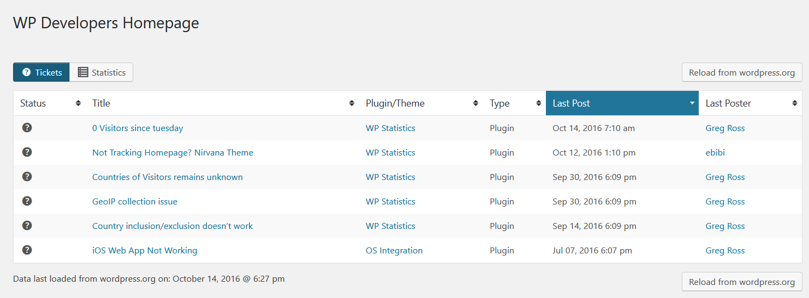
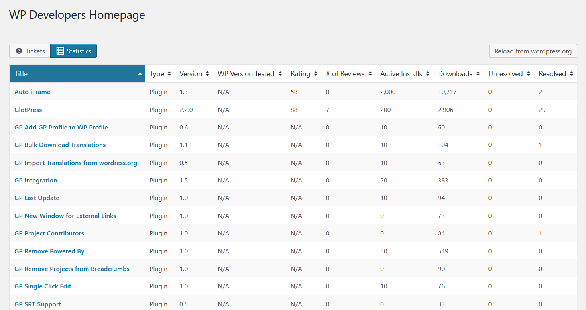
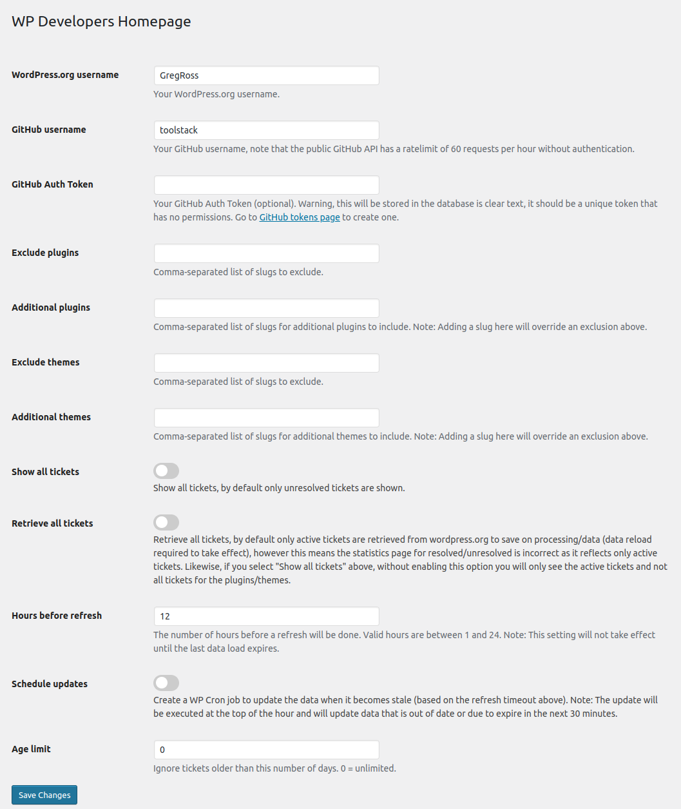

# WP Developers Homepage #
**Contributors:** [gregross](https://profiles.wordpress.org/gregross/)  
**Donate link:** http://wordpress.org/plugins/wp-developers-homepage  
**Tags:** developers, plugin, theme, unresolved, support, requests, tickets  
**Requires at least:** 5.0  
**Requires PHP:** 7.2  
**Tested up to:** 6.1.1  
**Stable tag:** 1.1  
**License:** GPLv2  
**License URI:** http://www.gnu.org/licenses/gpl-2.0.html  

The better tool for monitoring your plugins & themes, including support requests, download stats, version support, and more.

## Description ##

WP Developers Homepage provides a central place for developers of WordPress plugins and themes to see their information:

1. View and respond to all of your unresolved plugin & theme support requests.
2. View useful statistics for all of your plugins & themes.

Based on Mickey Kay's great [WP Dev Dashboard](https://wordpress.org/plugins/wp-dev-dashboard/).

### Features ###
* Displays plugin and theme support requests in a sortable table for ease of use.
* Displays all plugins and themes in a sortable, easy-to-parse table.
* Select which plugins and themes to show by username and/or slug.
* Choose whether to show all support tickets, or just unresolved ones.
* Implements caching to reduce load time for plugin and theme support ticket information.
* Includes cache-busting "refresh" option to force refresh plugin and theme support ticket data.
* Exclusion of plugins and themes.
* Additional information on tickets, including last poster and time.
* Set an age limit for the tickets displayed.
* Set the timeout before new data is loaded.
* Schedule a WP Cron job to load the data in the background.
* Shortcode/Gutenberg Block to display both tickets and stats on the frontend.
* Optionally includes tickets from GitHub.

### GitHub Support ###

Host your plugins on GitHub?  WP Developers Homepage can pull your ticket information from there too!

Simply add your GitHub username to the WP Developers Homepage settings.

Note: Your GitHub repos for your themes/plugins must match your slug.  So for example, this plugin's slug is wp-developers-homepage, so the GitHub url for it's repo is [https://github.com/toolstack/wp-developers-homepage](https://github.com/toolstack/wp-developers-homepage).

WP Developers Homepage uses the GitHub API to retrieve the ticket information, which by default has a limit of 60 request/hour for unauthenticated users.  Each plugin/theme you have will generate at least one request, and if you have a significant number of tickets (over 100) it will generate 1 request/repo/100 items.

So if you have 5 plugins, with 150 tickets per plugin, you'll generate 10 requests (2 per plugin).

If you need more than 60 requests/hour, you can [create an access token](https://github.com/settings/tokens/?type=beta) that will increase this limit.  The token should be limited to the plugin/theme repos you have and should have no permission assigned to it.  *DO NOT* reuse an existing token that you have assigned permissions to.

*Warning*: The access token will be stored in plain text inside of the WordPress database!

Once you have the token, go to the WP Developers Homepage settings and save it.

### Shortcode ###

The shortcode is in the format of `[wp-developers-homepage type=tickets|stats]`.

Type came be either left off (tickets are the default in that case), or be set to either `tickets` or `stats` to display the respective table.

Be aware that the stats table is very wide, so if you have a narrow theme installed it may overflow into a scrolling window.

## Installation ##

1. Install the plugin from the wordpress.org plugin directory.
2. Go to Settings->WP Developers Homepage in the WP admin menu.
3. Go to the WP Developers Homepage in the WP admin menu.

## Frequently Asked Questions ##

### Why don't my ticket totals match those on WordPress/GitHub ###

If you've enabled an age limit, only those tickets newer will be retrieved an counted.  This is done to limit the number of request going to WordPress/GitHub.

### Why is "Retrieve all tickets" disabled by default? ###

If you have a lot of old tickets, or many plugins/themes, it takes quite a bit of processing and data to get *all* of the tickets.  Instead, by default, only *active* tickets are retrieved.

### Why are the Unresolved/Resolved counts on the statistics table incorrect? ###

The statistics table values for Unresolved/Resolved are calculated based upon the data stored by WP Developers Homepage, and so two options can limit what is retrieved from wordpress.org:

1. Retrieve all tickets, which is disabled by default.
2. Age limit

These options tell WP Developers Homepage to stop retrieving data based upon either status or age of the tickets.  As inactive/old tickets are therefore not stored, they are not reflected in the statistics table.

If you wish to see a true representation of all your tickets, set the age limit to 0, and enabled the retrieve all tickets options.

This will significantly increase the time taken to download new data from wordpress.org.

## Screenshots ##

### 1. Support tickets for plugins/themes. ###

### 2. Statistics for plugins/themes. ###

### 3. Settings page. ###

## Changelog ##
### 1.0 ###
* Release Date: Jan 15, 2023
* Fixed: Force composer to assume php 7.2.5 for better compatibility.

### 1.0 ###
* Release Date: Jan 14, 2023
* Added: Shortcode/Gutenberg Blocks.
* Added: GitHub support.
* Added: Option to retrieve all tickets from wordpress.org
* Fixed: Setting an age limit for tickets no longer retrieves tickets older than that age limit instead of just not displaying them.

### 0.8 ###
* Release Date: Jan 2, 2023
* Fixed: Compatibility with PHP 7+.
* Fixed: Parsing of wordpress.org pages.
* Fixed: ...basically just made it work again ;)
* Added: Totals/averages to the stats table.

### 0.7 ###
* Release Date: January 15, 2017
* Fixed: Update parser to handle new forum structure for resolved tickets.

### 0.6 ###
* Release Date: November 17, 2016
* Updated: Increased the number of results retrieved from wordpress.org for author plugins/themes.

### 0.5 ###
* Release Date: Never
* Added: Exclusion of plugins and themes.
* Added: Additional information on tickets, including last poster and time.
* Added: JavaScript sorting of table data, no more page reloads!
* Added: Set an age limit for the tickets displayed.
* Added: Exclude closed and sticky tickets.
* Added: Set the timeout before new data is loaded.
* Added: Schedule a WP Cron job to load the data in the background.
* Added: Display previous data if an update for a plugin/theme fails.
* Added: Display the last data load time.
* Updated: Simplified UI.
* Updated: Tickets presented in a single table instead of multiple metaboxes.
* Forked: From @mickeykay's WP Dev Dashboard V1.4.0 (https://github.com/MickeyKay/wp-dev-dashboard or https://wordpress.org/plugins/wp-dev-dashboard/).

